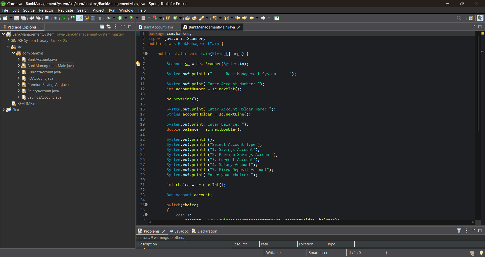
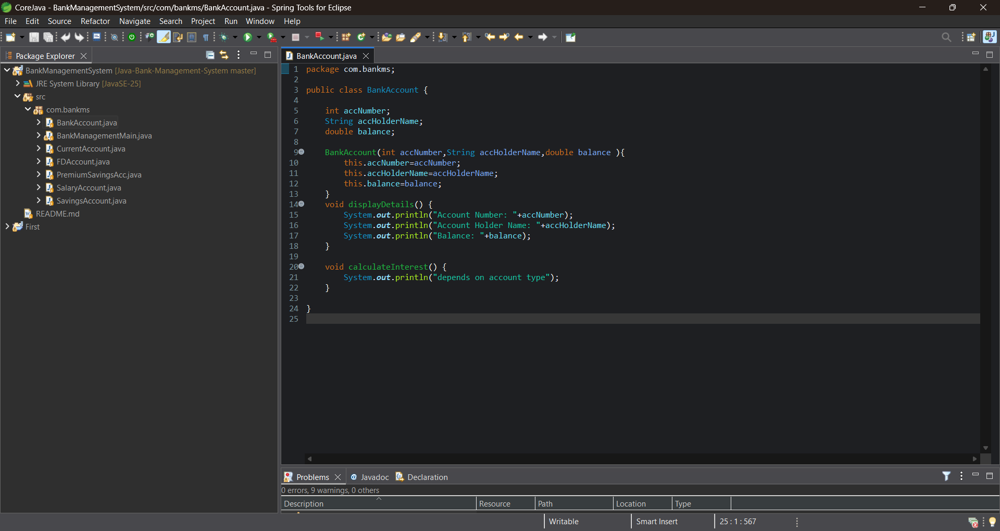
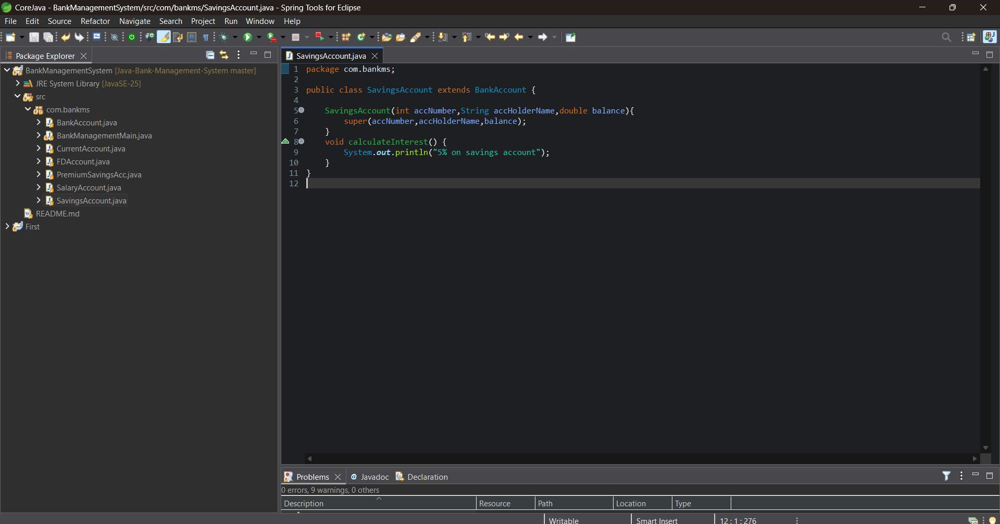
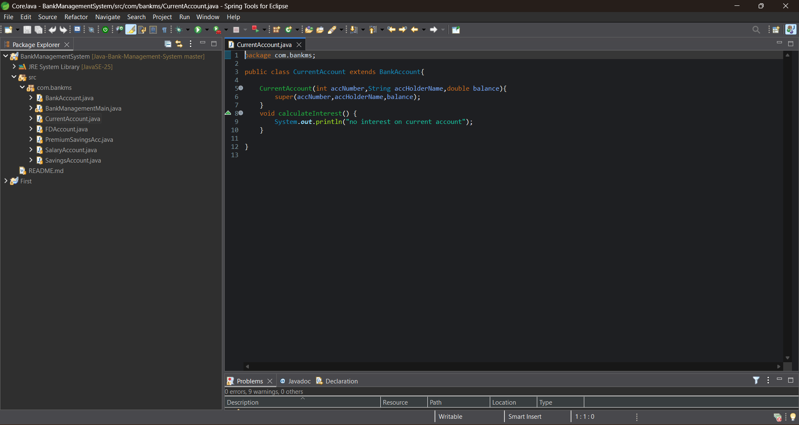
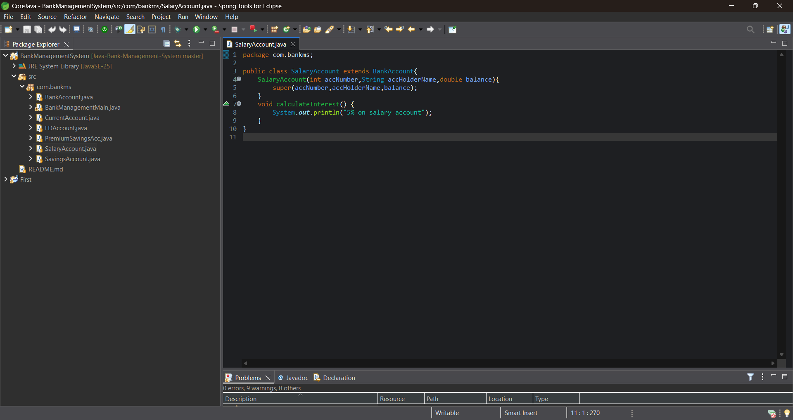
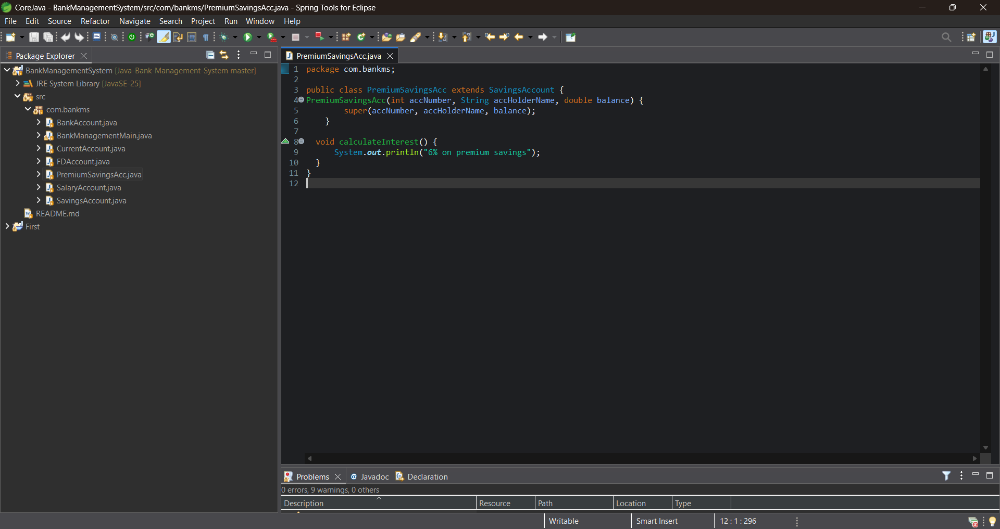
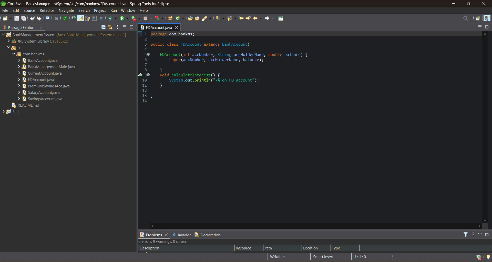
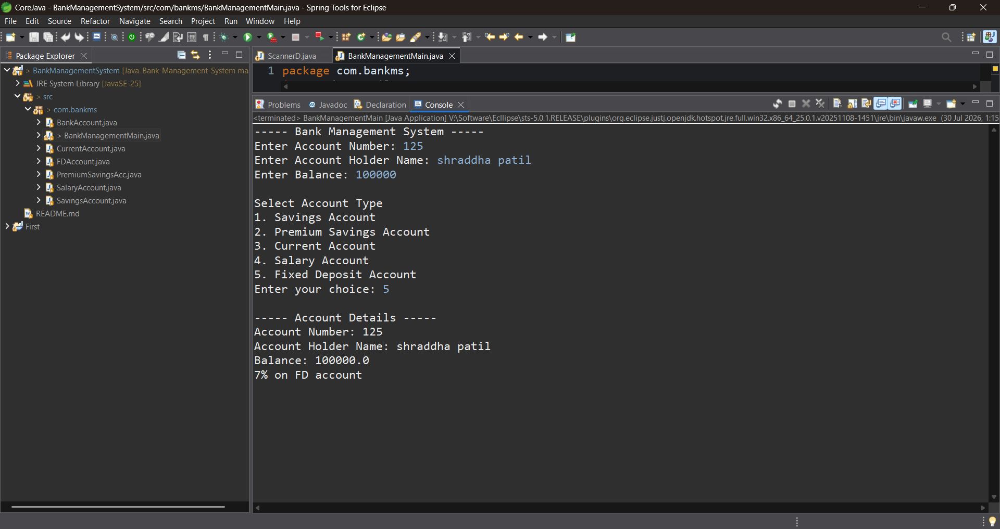

# 🏦 Bank Management System (Java)

A console-based Bank Management System developed in Java to demonstrate all major Object-Oriented Programming concepts, especially **Inheritance**, **Constructor Chaining**, **Method Overriding**, and **Runtime Polymorphism**.

---

## ✨ Features

- Create different bank account types
- Deposit money
- Withdraw money
- Check account details
- Runtime polymorphism using parent references
- Constructor chaining using `super`
- Method overriding
- Menu-driven console application

---

## 🛠 Technologies Used

- Java
- Eclipse / Spring Tool Suite (STS)
- Git
- GitHub

---

## 📚 OOP Concepts Demonstrated

- ✅ Single Inheritance
- ✅ Multilevel Inheritance
- ✅ Hierarchical Inheritance
- ✅ Method Overriding
- ✅ Runtime Polymorphism
- ✅ Constructor Chaining
- ✅ `super` Keyword

---

## 🏦 Account Types

- Bank Account
- Savings Account
- Current Account
- Salary Account
- Premium Savings Account
- Fixed Deposit Account

---

## 📂 Project Structure

```
BankManagementSystem/
│
├── src/
│   ├── BankAccount.java
│   ├── SavingsAccount.java
│   ├── CurrentAccount.java
│   ├── SalaryAccount.java
│   ├── PremiumSavingsAccount.java
│   ├── FixedDepositAccount.java
│   └── BankManagementMain.java
│
└── screenshots/
```

---

# 📸 Screenshots

### Main Menu



---

### Bank Account



---

### Savings Account



---

### Current Account



---

### Salary Account



---

### Premium Savings Account



---

### Fixed Deposit Account



---

### Final Output



---

## 🚀 How to Run

1. Clone this repository.
2. Open the project in Eclipse/STS.
3. Run `BankManagementMain.java`.
4. Follow the console menu.

---

## 👩‍💻 Author

**Greeshma Patil**

- GitHub: https://github.com/greeshmapatil07
